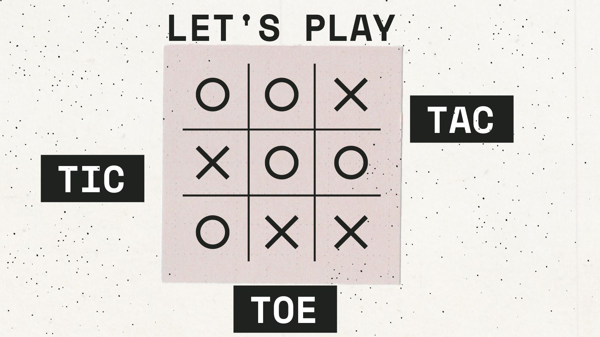

# Tic Tac Toe

This is my command line tic-tac-toe game written in python. You play this on your terminal and type in the number which 
corresponds to the position that you want to place your X or O.  

The grid looks as below when the game begins.
```commandline
         0 | 1 | 2 
        -----------
         3 | 4 | 5
        -----------
         6 | 7 | 8
Type the number to place the X: 
```
In this example, if i pressed 5, the result will be.

```commandline
 
         0 | 1 | 2 
        -----------
         3 | 4 | 5
        -----------
         6 | 7 | 8
Type the number to place the X: 5
 
         0 | 1 | 2 
        -----------
         3 | 4 | X
        -----------
         6 | 7 | 8
Type the number to place the O: 
```

The next player can then play any number apart from 5 as shown below.

```commandline
         0 | 1 | 2 
        -----------
         3 | 4 | X
        -----------
         6 | 7 | 8
Type the number to place the O: 0
 
         O | 1 | 2 
        -----------
         3 | 4 | X
        -----------
         6 | 7 | 8
Type the number to place the X: 
```
 This goes on until there is a winner of the game.

## Run

This is how you run the code below in this directory.

```commandline
$ python3 main.py
```

## Output

This is what is expected after running the code with the above command.

```commandline
 $ python main.py
 
         0 | 1 | 2 
        -----------
         3 | 4 | 5
        -----------
         6 | 7 | 8
Type the number to place the X: 
```
