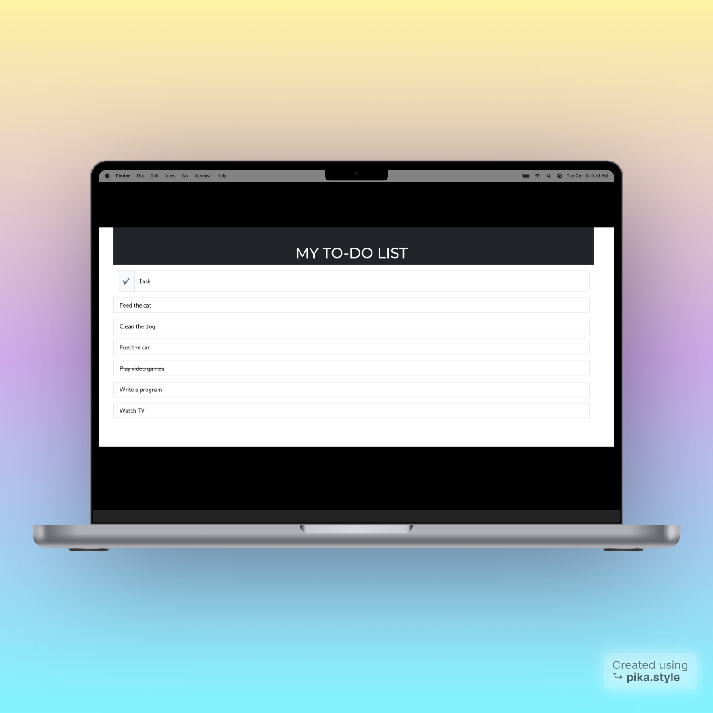

# To Do List v2.0

## Description

Welcome to my project! This is a To-do list App made in Python and the Flask framework. It allows users to quickly and 
easily add, delete, and update tasks. With this App, users can effortlessly manage their tasks, 
helping them stay organized and on top of their to-do list. I hope you enjoy and I look forward to your contributions.

## Contributing

I welcome any and all contributions. Here are some ways you can get started:  

Report bugs: If you encounter any bugs, please let me know. Open up an issue and let me know the problem.  
Contribute code: If you are a developer and want to contribute, follow the instructions below to get started  
Suggestions: If you don't want to code but have some awesome ideas, open up an issue explaining some updates or 
improvements you would like to see!  

## Instructions
<ol>
<li>Fork this repository</li>
<li>Clone the forked repository</li>
<li>Add your contributions (code or documentation)</li>
<li>Commit and push</li>
<li>Wait for pull request to be merged</li>
</ol>

## Guide

Here is a quick guide showing our users how to use the app.  

<ul>
<li>Click the task text area to type in the task you want to add then press enter to add it.</li>
<li>When you're done with the task just click it and watch the words get a strikethrough.</li>
<li>When you want to erase the completed task from the history, click on the desired completed task one more time and 
the entry will be deleted.</li>
</ul>

## Running

To run this application, install the Flask framework and Flask SQLalchemy so that the web app can access the database.

```commandline
pip install flask_sqlalchemy
```

## Screennshots




## License

This application is free to use and modify.